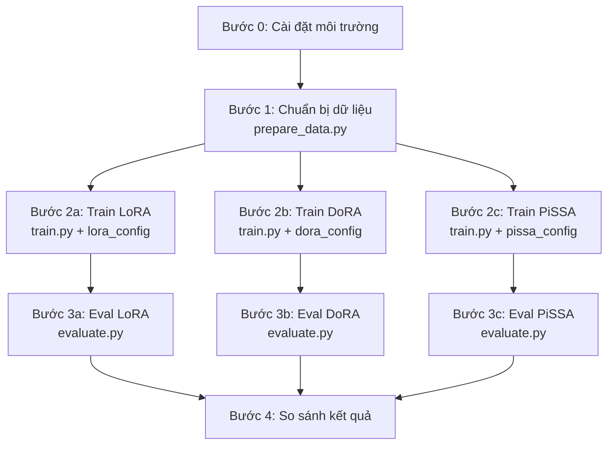
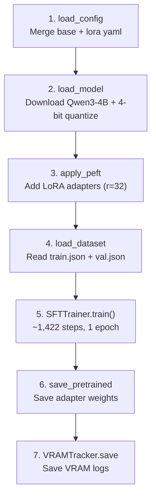

# 🧪 Hướng Dẫn Chạy Thí Nghiệm Chi Tiết

> Từ download → chuẩn bị dữ liệu → train 3 methods → đánh giá → so sánh

---

## Tổng quan



---

## Bước 0 — Cài đặt môi trường

### 0.1 Clone repo

```bash
git clone https://github.com/TuTTC/CS431-DoRA-vs-PiSSA-LegalSLM.git
cd CS431-DoRA-vs-PiSSA-LegalSLM
```

### 0.2 Tạo môi trường Python

```bash
# Dùng conda (khuyến nghị)
conda create -n cs431 python=3.10 -y
conda activate cs431

# Cài PyTorch (chọn đúng CUDA version của bạn)
# CUDA 12.1:
pip install torch torchvision --index-url https://download.pytorch.org/whl/cu121
# CUDA 11.8:
pip install torch torchvision --index-url https://download.pytorch.org/whl/cu118
```

### 0.3 Cài dependencies

```bash
pip install -r requirements.txt
```

### 0.4 Login HuggingFace (nếu cần)

```bash
pip install huggingface_hub
huggingface-cli login
# Nhập token từ https://huggingface.co/settings/tokens
```

### 0.5 (Tùy chọn) Login WandB

```bash
wandb login
# Nhập API key từ https://wandb.ai/authorize
```

> [!TIP]
> Nếu không muốn dùng WandB, set `WANDB_DISABLED=true` trước khi chạy train.

---

## Bước 1 — Chuẩn bị dữ liệu

### File chạy: [prepare_data.py](file:///d:/NĂM%203/CS431/CS431-DoRA-vs-PiSSA-LegalSLM/data/prepare_data.py)

### Chức năng
- Download dataset `QuangTran276/new_reasoning` (~205K mẫu) từ HuggingFace
- Download Public Test `VLSP2025-LegalSML/Public-Test` (440 mẫu: 146 MCQ + 150 NLI + 144 Syllogism)
- Convert conversation format → Qwen3 ChatML (`<|im_start|>`/`<|im_end|>`)
- Auto-classify task type từ system prompt
- Split train/val + save test riêng

### Lệnh chạy

```bash
python data/prepare_data.py \
    --hf_dataset QuangTran276/new_reasoning \
    --public_test VLSP2025-LegalSML/Public-Test \
    --output_dir data/processed
```

### Output mong đợi

```
[DATA] Loading HuggingFace dataset: QuangTran276/new_reasoning
[DATA] Loaded 205052 samples from HuggingFace
[DATA] Converted 205052 samples to ChatML format
[DATA] Task distribution: {'task1': ..., 'task2': ..., 'task3': ...}
[DATA] Loading Public Test: VLSP2025-LegalSML/Public-Test
[DATA]   multichoice_questions: 146 samples
[DATA]   nli_questions: 150 samples
[DATA]   syllogism_questions: 144 samples
[DATA] Total Public Test samples: 440
[DATA] Split: train=182268, val=22784
[DATA] Public Test: 440 samples
[DATA] Saved 182268 samples to data/processed/train.json
[DATA] Saved 22784 samples to data/processed/val.json
[DATA] Saved 440 samples to data/processed/test.json
[DATA]  Data preparation completed!
```

### Files được tạo

```
data/processed/
├── train.json    (~182K mẫu, ~400-500 MB)
├── val.json      (~23K mẫu, ~50 MB)
└── test.json     (440 mẫu, ~1 MB)
```

---

## Bước 2a — Train LoRA (Baseline)

### Files liên quan
| File | Vai trò |
|------|---------|
| [train.py](file:///d:/NĂM%203/CS431/CS431-DoRA-vs-PiSSA-LegalSLM/training/train.py) | Script training chính |
| [trainer_utils.py](file:///d:/NĂM%203/CS431/CS431-DoRA-vs-PiSSA-LegalSLM/training/trainer_utils.py) | Load model, apply PEFT, format prompts |
| [base_config.yaml](file:///d:/NĂM%203/CS431/CS431-DoRA-vs-PiSSA-LegalSLM/configs/base_config.yaml) | Config chung (model, training params) |
| [lora_config.yaml](file:///d:/NĂM%203/CS431/CS431-DoRA-vs-PiSSA-LegalSLM/configs/lora_config.yaml) | Config riêng LoRA |

### Config tóm tắt
```
Model:    VLSP2025-LegalSML/qwen3-4b-legal-pretrain (4-bit)
Method:   LoRA (use_dora=false, init=Kaiming random)
Rank:     32, Alpha: 64
LR:       2e-5, Epochs: 1, Effective BS: 128
```

### Lệnh chạy

```bash
python training/train.py --peft_config configs/lora_config.yaml
```

### Flow bên trong



### Output mong đợi

```
============================================================
  PEFT Method: LORA
============================================================
[MODEL] Loaded: VLSP2025-LegalSML/qwen3-4b-legal-pretrain
[PEFT] Applied method: LORA
[PEFT] Rank: 32, Alpha: 64
[PEFT] Trainable params: 66,060,288 / 4,080,636,928 (1.62%)
[DATA] Train samples: 182268
[DATA] Val samples:   22784
[TRAIN] Starting training with LORA...
  ... training progress ...
[TRAIN] Training completed!
[SAVE] Adapter saved to: outputs/checkpoints/lora
[SAVE] Training metrics saved to: outputs/results/lora_train_metrics.json
```

### Files được tạo

```
outputs/
├── checkpoints/lora/
│   ├── adapter_model.safetensors    ← LoRA weights (~130MB)
│   ├── adapter_config.json
│   └── tokenizer files...
├── results/
│   ├── lora_train_metrics.json      ← Loss, runtime, etc.
│   └── vram_logs/lora_vram.csv      ← VRAM per stage
└── logs/lora/                        ← TensorBoard logs
```

---

## Bước 2b — Train DoRA

### Config khác biệt so với LoRA

```diff
  use_dora: false    →    use_dora: true      # BẬT DoRA
```

### Lệnh chạy

```bash
python training/train.py --peft_config configs/dora_config.yaml
```

> [!NOTE]
> Cùng [train.py](file:///d:/N%C4%82M%203/CS431/CS431-DoRA-vs-PiSSA-LegalSLM/training/train.py) — chỉ đổi config file. DoRA chậm hơn LoRA ~15-25% do thêm magnitude normalization.

---

## Bước 2c — Train PiSSA

### Config khác biệt so với LoRA

```diff
  init_lora_weights: true    →    init_lora_weights: "pissa"   # SVD init
  learning_rate: 2.0e-5      →    learning_rate: 1.0e-5        # LR thấp hơn
```

### Lệnh chạy

```bash
python training/train.py --peft_config configs/pissa_config.yaml
```

> [!NOTE]
> PiSSA mất thêm ~1-5 phút đầu để tính SVD decomposition. Sau đó tốc độ training bằng LoRA.

---

## Bước 3 — Đánh giá (Evaluation)

### File chạy: [evaluate.py](file:///d:/NĂM%203/CS431/CS431-DoRA-vs-PiSSA-LegalSLM/evaluation/evaluate.py)

### Chức năng
- Load model + adapter checkpoint
- Chạy inference trên `test.json` (440 mẫu Public Test)
- Tính metrics theo task type:
  - **Task 1 (NLI):** Accuracy — `1[ŷ = y]`
  - **Task 2 (MCQ):** Accuracy — `1[ŷ = y]`
  - **Task 3 (QA):** Exact Match — `1[ν(â) = ν(a)]`
- Lưu kết quả JSON

### Lệnh chạy (3 lần, 1 per method)

```bash
# Evaluate LoRA
python evaluation/evaluate.py \
    --peft_config configs/lora_config.yaml \
    --skip_ppl

# Evaluate DoRA
python evaluation/evaluate.py \
    --peft_config configs/dora_config.yaml \
    --skip_ppl

# Evaluate PiSSA
python evaluation/evaluate.py \
    --peft_config configs/pissa_config.yaml \
    --skip_ppl
```

> [!TIP]
> `--skip_ppl` bỏ qua Perplexity để tiết kiệm thời gian. Bỏ flag này nếu muốn tính PPL.

### Output mong đợi (ví dụ cho LoRA)

```
============================================================
  Evaluating: LORA
  Task:       ALL (auto-detect per sample)
============================================================
[EVAL] Loading adapter from: outputs/checkpoints/lora
[EVAL] Test samples: 440
[EVAL] Generating responses...
Inference: 100%|█████████| 440/440

--- Metrics for task1 (150 samples) ---
[EVAL] Computing Citation Accuracy (Task 1)...
  Accuracy:   0.XXXX
  Parse rate: 0.XXXX

--- Metrics for task2 (146 samples) ---
[EVAL] Computing MCQ Accuracy (Task 2)...
  MCQ Accuracy:   0.XXXX

--- Metrics for task3 (144 samples) ---
[EVAL] Computing Exact Match (Task 3)...
  Exact Match: 0.XXXX

[SAVE] Results saved to: outputs/results/lora_eval_results.json
```

### Files được tạo

```
outputs/results/
├── lora_eval_results.json
├── dora_eval_results.json
└── pissa_eval_results.json
```

---

## Bước 4 — So sánh kết quả

### 4.1 So sánh Metrics (chạy trong Python)

```python
import json

methods = ["lora", "dora", "pissa"]
print(f"{'Metric':<25} {'LoRA':>10} {'DoRA':>10} {'PiSSA':>10}")
print("-" * 57)

results = {}
for m in methods:
    with open(f"outputs/results/{m}_eval_results.json") as f:
        results[m] = json.load(f)

for key in ["citation_accuracy", "mcq_accuracy", "qa_exact_match"]:
    values = [results[m].get(key, results[m].get(f"task1/{key}", results[m].get(f"task2/{key}", results[m].get(f"task3/{key}", "N/A")))) for m in methods]
    print(f"{key:<25} {values[0]:>10.4f} {values[1]:>10.4f} {values[2]:>10.4f}")
```

### 4.2 So sánh VRAM

```python
from utils.helpers import check_memory_efficiency, plot_vram_comparison

check_memory_efficiency("outputs/results/vram_logs")
plot_vram_comparison()
```

---

## Tóm tắt: Tất cả lệnh chạy tuần tự

```bash
# ═══════════════ BƯỚC 0: CÀI ĐẶT ═══════════════
conda create -n cs431 python=3.10 -y && conda activate cs431
pip install torch --index-url https://download.pytorch.org/whl/cu121
pip install -r requirements.txt
huggingface-cli login

# ═══════════════ BƯỚC 1: DỮ LIỆU ═══════════════
python data/prepare_data.py \
    --hf_dataset QuangTran276/new_reasoning \
    --public_test VLSP2025-LegalSML/Public-Test

# ═══════════════ BƯỚC 2: TRAINING ═══════════════
# 2a. LoRA (Baseline)
python training/train.py --peft_config configs/lora_config.yaml

# 2b. DoRA
python training/train.py --peft_config configs/dora_config.yaml

# 2c. PiSSA
python training/train.py --peft_config configs/pissa_config.yaml

# ═══════════════ BƯỚC 3: EVALUATION ═══════════════
python evaluation/evaluate.py --peft_config configs/lora_config.yaml --skip_ppl
python evaluation/evaluate.py --peft_config configs/dora_config.yaml --skip_ppl
python evaluation/evaluate.py --peft_config configs/pissa_config.yaml --skip_ppl
```

---

## Troubleshooting

| Lỗi | Nguyên nhân | Giải pháp |
|-----|-------------|-----------|
| `CUDA OOM` | Batch size quá lớn | Giảm `per_device_train_batch_size` (16→8→4), tăng `gradient_accumulation_steps` tương ứng |
| `ValueError: Unsloth` | Unsloth chưa cài | `pip install "unsloth[colab-new] @ git+https://github.com/unslothai/unsloth.git"` |
| `wandb: ERROR` | Chưa login WandB | `WANDB_DISABLED=true python training/train.py ...` |
| `Dataset not found` | HF dataset riêng tư | `huggingface-cli login` với token có quyền đọc |
| SVD quá chậm (PiSSA) | GPU yếu | Bình thường, chờ 3-5 phút cho SVD init |
